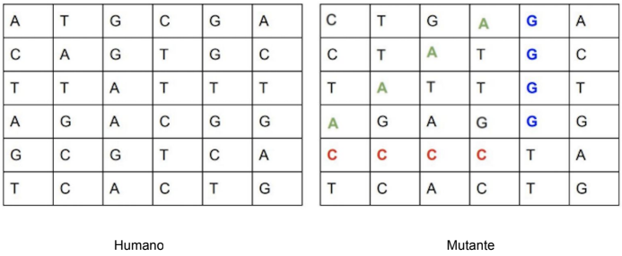

## Introdução

Este projeto contém uma aplicação que recebe (endpoint: mutant) uma cadeia genética, e retorna se esta contém genes mutantes ou não.
Uma cadeia genética pode ser representada por um array de Strings, que formam uma tabela quadrada de (**NxN**) com a sequência de **DNA**. Exemplo:

Cada gene só pode conter as letras **A** - **G** - **T** - **A**. Você saberá se um DNA pertence a um mutante, se encontrar uma ou mais sequências de quatro
letras iguais nas direções **horizontais**, **verticais** ou nas **diagonais**.

## Configuração de Ambiente 🚧
1) Tenha o postgresql 10+, MAVEN e JDK (Java Development Kit) instalados e configurados;
   - [Instalando o postgres no windows](https://www.devmedia.com.br/instalando-postgresql/23364);
   - [Instalando o postgres no linux](https://medium.com/@thiago.reis/instalando-e-configurando-postgresql-no-ubuntu-86716cda5894);
   - [Instalando e configurando o maven e a JDK](https://medium.com/beelabacademy/configurando-vari%C3%A1veis-de-ambiente-java-home-e-maven-home-no-windows-e-unix-d9461f783c26)
2) Crie um usuário e uma base de dados, ambos com o nome de "**mutants**";
   - Se preferir, utilize outros nomes, mas altere os parâmetros em [application-dev.yml](https://github.com/emanuelvictor/mutants/blob/dev/src/main/resources/config/application-dev.yml).
3) Crie uma base de dados chamada "**mutants_test**", essa base será utilizada durante a execução dos testes automatizados;
   - Se preferir, utilize outros nomes, mas altere os parâmetros em [application-test.yml](https://github.com/emanuelvictor/mutants/blob/dev/src/test/resources/config/application-test.yml).
4) Depois da base configurada, rode o script sql [01032022142600_CREATE_INDIVIDUAL_TABLE.sql](https://github.com/emanuelvictor/mutants/tree/dev/src/main/resources/db/01032022142600_CREATE_INDIVIDUAL_TABLE.sql). 

## Execução e testes 🚀

1) Execute o comando ``mvn clean package && java -jar target/mutants-0.0.1-SNAPSHOT.jar`` na raíz do projeto.
2) A aplicação será iniciada na porta **8080**, o resultado dos testes estarão em *./target/site/index.html*
3) A aplicação também está disponível [aqui](https://mutantts.herokuapp.com/)
      > **Atenção:** Por se tratar de uma aplicação hospedada no heroku, utilizando opções gratuitas. O serviço eventualmente poderá estar indisponível. Isso ocorre porque o heroku desliga as aplicações que não estão sendo acessadas. 
      Caso isso aconteça, aguarde um ou dois minutos e o serviço será reestabelecido.

<h4 align='end'> 
	Obrigado 😎
</h4>
